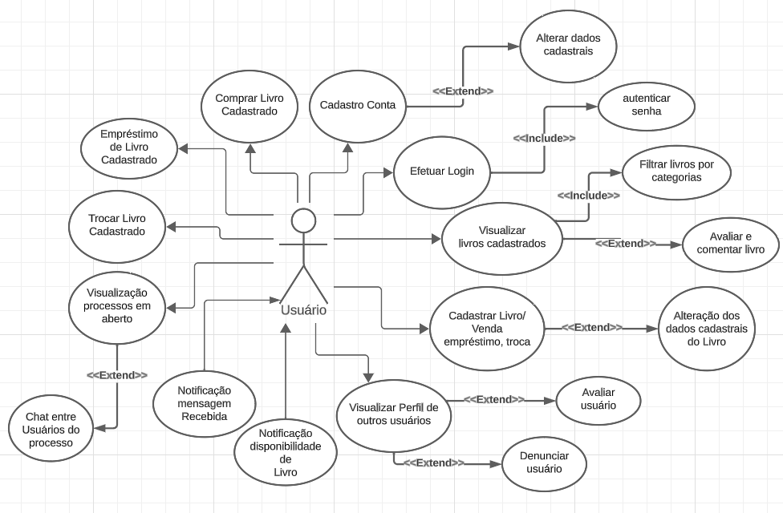

# Especificações do Projeto

Pré-requisitos: <a href="1-Documentação de Contexto.md"> Documentação de Contexto</a>

Definição do problema e ideia de solução a partir da perspectiva do usuário. É composta pela definição do  diagrama de personas, histórias de usuários, requisitos funcionais e não funcionais além das restrições do projeto.

Apresente uma visão geral do que será abordado nesta parte do documento, enumerando as técnicas e/ou ferramentas utilizadas para realizar a especificações do projeto

## Personas

## Histórias de Usuários

Com base na análise das personas forma identificadas as seguintes histórias de usuários:

|EU COMO... `PERSONA`| QUERO/PRECISO ... `FUNCIONALIDADE` |PARA ... `MOTIVO/VALOR`                 |
|--------------------|------------------------------------|----------------------------------------|
|  Ana  |  criar minha própria conta e cadastrar meu endereço   |  ter acesso ao aplicativo e meu próprio perfil |
|  Ana  |  entrar no sistema usando meu e-mail e senha  |  ter acesso ao meu próprio perfil de usuário | 
|  Ana  |  cadastrar uma foto de perfil  |  customizar minha experiencia de uso | 
|  Ana  |  alterar minhas informações de usuário  |  tornar minha experiencia de uso mais personalizada |
|  Ana  |  ter acesso a uma lista com livros que possam ser negociados com outros usuários  |  ter acesso a outros livros sem gastar dinheiro | 		
|  Luíza  |  ter acesso a um chat  |  me comunicar com outro usuário no momento da negociação |	 
|  Luíza  |  ser notificada quando um livro for solicitado para aluguel ou compra  |  que a negociação seja rápida e satisfatória | 
|  Luíza  |  solicitar o cancelamento de um processo de venda ou aluguel de um livro  |  impedir maiores contratempos quando a negociação não for possível | 
|  Luíza  |  denunciar um usuário  |  que a comunidade de usuários possa identificar um usuário mal-intencionado |			 
|  Luíza  |  possibilitar de trocar livros com outros usuários  |  ter acesso a outros livros sem gastar dinheiro | 
|  Luíza  |  ser notificado quando alguma transação que me envolva sofrer atualização  |  me planejar minha rotina para algum evento que possa surgir | 
|  Flávio  |  pesquisar por um livro específico  |  facilitar minha busca por livros do meu interesse |  
|  Flávio  |  permitir que a lista com livros que estão disponíveis para negociação permita filtrar as informações  |  facilitar minha busca por livros do meu interesse |			 
|  Rafael  |  cadastrar meu livro  |  poder disponibilizá-los para negociação(venda, emprestimo ou troca) e fazer um dinheiro extra | 
|  Rafael  |  cadastrar fotos do livro que estou disponibilizando para aluguel ou venda  |  que o comprador veja o estado do produto | 
|  Rafael  |  ter uma lista com os meus produtos que esteja em negociação  |  me planejar minha rotina para algum evento que possa surgir | 
|  Rafael  |  filtrar a lista com os meus produtos |  facilitar meu planejamento | 
|  Rafael  |  ver as informações sobre minha negociação de um livro específico  |  me planejar para a conclusão do processo | 
|  Rafael  |  avaliar um processo de compra ou venda de livros  |  que outros usuários possam se informar sobre o processo |

Apresente aqui as histórias de usuário que são relevantes para o projeto de sua solução. As Histórias de Usuário consistem em uma ferramenta poderosa para a compreensão e elicitação dos requisitos funcionais e não funcionais da sua aplicação. Se possível, agrupe as histórias de usuário por contexto, para facilitar consultas recorrentes à essa parte do documento.

> **Links Úteis**:
> - [Histórias de usuários com exemplos e template](https://www.atlassian.com/br/agile/project-management/user-stories)
> - [Como escrever boas histórias de usuário (User Stories)](https://medium.com/vertice/como-escrever-boas-users-stories-hist%C3%B3rias-de-usu%C3%A1rios-b29c75043fac)
> - [User Stories: requisitos que humanos entendem](https://www.luiztools.com.br/post/user-stories-descricao-de-requisitos-que-humanos-entendem/)
> - [Histórias de Usuários: mais exemplos](https://www.reqview.com/doc/user-stories-example.html)
> - [9 Common User Story Mistakes](https://airfocus.com/blog/user-story-mistakes/)

## Modelagem do Processo de Negócio 

### Análise da Situação Atual

Apresente aqui os problemas existentes que viabilizam sua proposta. Apresente o modelo do sistema como ele funciona hoje. Caso sua proposta seja inovadora e não existam processos claramente definidos, apresente como as tarefas que o seu sistema pretende implementar são executadas atualmente, mesmo que não se utilize tecnologia computacional. 

### Descrição Geral da Proposta

Apresente aqui uma descrição da sua proposta abordando seus limites e suas ligações com as estratégias e objetivos do negócio. Apresente aqui as oportunidades de melhorias.

### Processo 1 – NOME DO PROCESSO

Apresente aqui o nome e as oportunidades de melhorias para o processo 1. Em seguida, apresente o modelo do processo 1, descrito no padrão BPMN. 

### Processo 2 – NOME DO PROCESSO

Apresente aqui o nome e as oportunidades de melhorias para o processo 2. Em seguida, apresente o modelo do processo 2, descrito no padrão BPMN.

## Indicadores de Desempenho

Apresente aqui os principais indicadores de desempenho e algumas metas para o processo. Atenção: as informações necessárias para gerar os indicadores devem estar contempladas no diagrama de classe. Colocar no mínimo 5 indicadores. 

Usar o seguinte modelo: 

Obs.: todas as informações para gerar os indicadores devem estar no diagrama de classe a ser apresentado a posteriori. 

### Requisitos Funcionais

|ID    | Descrição do Requisito  | Prioridade |
|------|-----------------------------------------|----|
|RF-001| Permitir que o usuário se cadastre | ALTA | 
|RF-002| Permitir que o usuário cadastre seus endereços | ALTA |
|RF-003| Permitir que o usuário realize login através de seu email e senha | ALTA | 
|RF-004| Permitir ao usuário adicionar, alterar e excluir sua foto de perfil | BAIXA |
|RF-005| Permitir que o usuário altere sua senha | ALTA | 
|RF-006| Permitir ao usuário modificar suas informações pessoais | MÉDIA |
|RF-007| Exibir ao usuário uma lista de livros disponíveis para troca, venda ou aluguel | ALTA | 
|RF-008| Permitir aos usuários trocarem mensagens via chat | MÉDIA |
|RF-009| Notificar ao usuário quando um de seus livros forem solicitados para aluguel, compra ou troca | BAIXA | 
|RF-010| Permitir ao usuário cancelar uma venda, aluguel ou troca de um livro | ALTA |
|RF-011| Permitir ao usuário denunciar outro usuário | BAIXA | 
|RF-012| Permitir aos usuários negociarem livros (trocar, vender e alugar) | ALTA |
|RF-013| Notificar ao usuário quando suas negociações forem atualizadas | BAIXA | 
|RF-014| Permitir ao usuário pesquisar por um livro específico | MÉDIA |
|RF-015| Permitir ao usuário filtrar a lista de livros disponiveis para negociação | MÉDIA |
|RF-016| Permitir ao usuário cadastrar seus livros | ALTA |
|RF-017| Permitir ao usuário disponibilizar seus livros para negociação (aluguel, troca e venda) | ALTA |
|RF-018| Permitir ao usuário anexar fotos do livro ao seu anúncio | MÉDIA |
|RF-019| Listar ao usuário seus livros em negociação  | ALTA |
|RF-020| Permitir ao usuário filtrar a lista com seus livros em negociação | MÉDIA |
|RF-021| Permitir ver detalhes sobre uma negociação em específico | ALTA |
|RF-022| Permitir aos usuários avaliar as negociações de livro realizadas | MÉDIA |

### Requisitos não Funcionais

|ID     | Descrição do Requisito  |Prioridade |
|-------|-------------------------|----|
|RNF-001| O sistema deve ser responsivo para rodar em smartphones, tablets e computadores desktop | ALTA |  
|RNF-002| O aplicativo deve estar disponível para acesso a qualquer horário do dia |  BAIXA | 
|RNF-003| O aplicativo deve responder às ações do usuário em até 10 segundos |  ALTA | 
|RNF-004| Quando o tempo de resposta às ações do usuário for maior que 0,1 segundos, deve-se haver um feedback |  ALTA |
|RNF-005| As notificações sobre solicitações e alterações de negociações devem ser enviadas com no máximo 5 minutos |  BAIXA | 

## Restrições

O projeto está restrito pelos itens apresentados na tabela a seguir.

|ID| Restrição                                             |
|--|-------------------------------------------------------|
|01| O projeto deverá ser finalizado até o dia 10/12/2023 |
|02| A equipe não pode subcontratar o desenvolvimento do trabalho |

## Diagrama de Casos de Uso

O diagrama de casos de uso representa a conexão entre o uso do aplicativo (casos de uso) e os usuários (atores), demonstrando de forma abstrata as principais ligações entre as funcionalidades do App.

Segue o diagrama de casos de uso com as principais funcionalidades da aplicação RentABook.

Criado pelo web app LucidChart https://www.lucidchart.com

# Matriz de Rastreabilidade

A Matriz de Rastreabilidade de Requisitos é uma ferramenta crucial no desenvolvimento de projetos, assegurando a coesão entre requisitos e soluções implementadas. Nesta planilha, destacamos a interligação entre requisitos funcionais e não funcionais. Ao mapear essas conexões, obtemos clareza sobre dependências, impactos e garantimos que o projeto atenda consistentemente às demandas estabelecidas. Acompanhe abaixo para compreender como essa matriz pode aprimorar a gestão do projeto e a entrega de resultados.

# Gerenciamento de Projeto

De acordo com o PMBoK v6 as dez áreas que constituem os pilares para gerenciar projetos, e que caracterizam a multidisciplinaridade envolvida, são: Integração, Escopo, Cronograma (Tempo), Custos, Qualidade, Recursos, Comunicações, Riscos, Aquisições, Partes Interessadas. Para desenvolver projetos um profissional deve se preocupar em gerenciar todas essas dez áreas. Elas se complementam e se relacionam, de tal forma que não se deve apenas examinar uma área de forma estanque. É preciso considerar, por exemplo, que as áreas de Escopo, Cronograma e Custos estão muito relacionadas. Assim, se eu amplio o escopo de um projeto eu posso afetar seu cronograma e seus custos.

## Gerenciamento de Tempo

Com diagramas bem organizados que permitem gerenciar o tempo nos projetos, o gerente de projetos agenda e coordena tarefas dentro de um projeto para estimar o tempo necessário de conclusão.

O gráfico de Gantt ou diagrama de Gantt também é uma ferramenta visual utilizada para controlar e gerenciar o cronograma de atividades de um projeto. Com ele, é possível listar tudo que precisa ser feito para colocar o projeto em prática, dividir em atividades e estimar o tempo necessário para executá-las.

## Gerenciamento de Equipe

O gerenciamento adequado de tarefas contribuirá para que o projeto alcance altos níveis de produtividade. Por isso, é fundamental que ocorra a gestão de tarefas e de pessoas, de modo que os times envolvidos no projeto possam ser facilmente gerenciados. 

## Gestão de Orçamento

O processo de determinar o orçamento do projeto é uma tarefa que depende, além dos produtos (saídas) dos processos anteriores do gerenciamento de custos, também de produtos oferecidos por outros processos de gerenciamento, como o escopo e o tempo.

