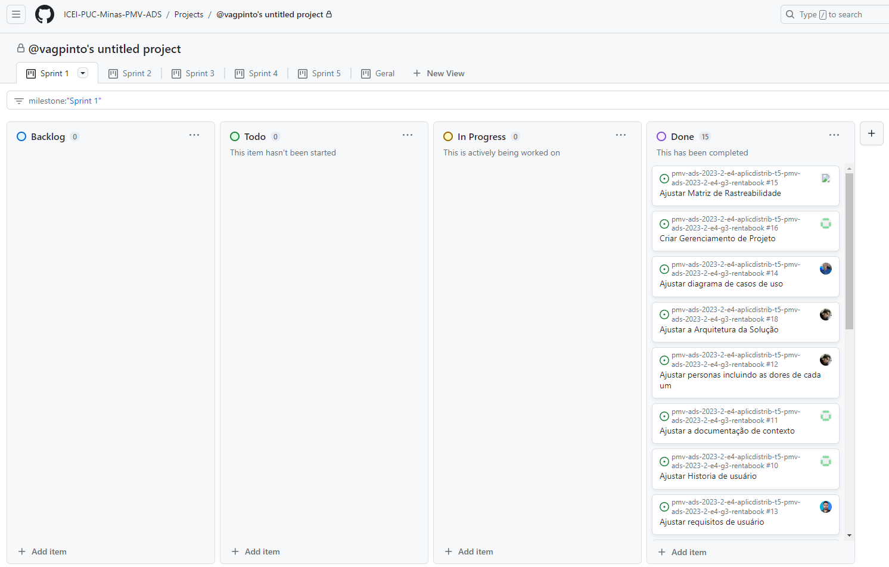

## Personas

## Histórias de Usuários

Com base na análise das personas forma identificadas as seguintes histórias de usuários:

|EU COMO... `PERSONA`| QUERO/PRECISO ... `FUNCIONALIDADE` |PARA ... `MOTIVO/VALOR`                 |
|--------------------|------------------------------------|----------------------------------------|
|  Ana  |  criar minha própria conta, podendo cadastrar foto e endereço   |  ter acesso ao aplicativo e meu próprio perfil |
|  Ana  |  entrar no sistema usando meu e-mail e senha  |  ter acesso ao meu próprio perfil de usuário | 
|  Ana  |  alterar minhas informações de usuário  |  tornar minha experiencia de uso mais personalizada |
|  Ana  |  ter acesso a uma lista com livros que possam ser negociados com outros usuários  |  ter acesso a outros livros sem gastar dinheiro | 		
|  Luíza  |  ter acesso a um chat  |  me comunicar com outro usuário no momento da negociação |	 
|  Luíza  |  ser notificada quando um livro for solicitado para aluguel ou compra  |  que a negociação seja rápida e satisfatória | 
|  Luíza  |  solicitar o cancelamento de um processo de venda ou aluguel de um livro  |  impedir maiores contratempos quando a negociação não for possível |		 
|  Luíza  |  possibilitar de trocar livros com outros usuários  |  ter acesso a outros livros sem gastar dinheiro | 
|  Luíza  |  ser notificado quando alguma transação que me envolva sofrer atualização  |  me planejar minha rotina para algum evento que possa surgir | 
|  Flávio  |  pesquisar por um livro específico  |  facilitar minha busca por livros do meu interesse |  
|  Flávio  |  permitir que a lista com livros que estão disponíveis para negociação permita filtrar as informações  |  facilitar minha busca por livros do meu interesse |			 
|  Rafael  |  cadastrar meu livro  |  poder disponibilizá-los para negociação(venda, emprestimo ou troca) e fazer um dinheiro extra | 
|  Rafael  |  cadastrar fotos do livro que estou disponibilizando para aluguel ou venda  |  que o comprador veja o estado do produto | 
|  Rafael  |  ter uma lista com os meus produtos que esteja em negociação  |  me planejar minha rotina para algum evento que possa surgir | 
|  Rafael  |  filtrar a lista com os meus produtos |  facilitar meu planejamento | 
|  Rafael  |  ver as informações sobre minha negociação de um livro específico  |  me planejar para a conclusão do processo | 
|  Rafael  |  avaliar um processo de compra ou venda de livros  |  que outros usuários possam se informar sobre o processo |

### Requisitos Funcionais

|ID    | Descrição do Requisito  | Prioridade |
|------|-----------------------------------------|----|
|RF-001| Permitir que o usuário se cadastre | ALTA | 
|RF-002| Permitir que o usuário cadastre ou altere seus endereços | ALTA |
|RF-003| Permitir que o usuário realize login através de seu email e senha | ALTA | 
|RF-004| Permitir ao usuário adicionar, alterar e excluir sua foto de perfil | BAIXA |
|RF-005| Permitir que o usuário altere sua senha | ALTA | 
|RF-006| Permitir ao usuário modificar suas informações pessoais | MÉDIA |
|RF-007| Exibir ao usuário uma lista de livros disponíveis para troca, venda ou aluguel | ALTA | 
|RF-008| Permitir aos usuários trocarem mensagens via chat | MÉDIA |
|RF-009| Notificar ao usuário quando um de seus livros forem solicitados para aluguel, compra ou troca | BAIXA | 
|RF-010| Permitir ao usuário cancelar uma venda, aluguel ou troca de um livro | ALTA | 
|RF-011| Notificar ao usuário quando suas negociações forem atualizadas | BAIXA | 
|RF-012| Permitir ao usuário pesquisar por um livro específico | MÉDIA |
|RF-013| Permitir ao usuário filtrar a lista de livros disponiveis para negociação | MÉDIA |
|RF-014| Permitir ao usuário cadastrar e disponibilizar seus livros para negociação (aluguel, troca e venda) | ALTA |
|RF-016| Permitir ao usuário anexar fotos do livro ao seu anúncio | MÉDIA |
|RF-017| Listar ao usuário seus livros em negociação  | ALTA |
|RF-018| Permitir ao usuário filtrar a lista com seus livros em negociação | MÉDIA |
|RF-019| Permitir ver detalhes sobre uma negociação em específico | ALTA |
|RF-020| Permitir aos usuários avaliar as negociações de livro realizadas | MÉDIA |

### Requisitos não Funcionais

|ID     | Descrição do Requisito  |Prioridade |
|-------|-------------------------|----|
|RNF-001| O sistema deve ser responsivo para rodar em smartphones, tablets e computadores desktop | ALTA |  
|RNF-002| O aplicativo deve estar disponível para acesso a qualquer horário do dia |  BAIXA | 
|RNF-003| O aplicativo deve responder às ações do usuário em até 10 segundos |  ALTA | 
|RNF-004| Quando o tempo de resposta às ações do usuário for maior que 0,1 segundos, deve-se haver um feedback |  ALTA |
|RNF-005| As notificações sobre solicitações e alterações de negociações devem ser enviadas com no máximo 5 minutos |  BAIXA | 

## Restrições

O projeto está restrito pelos itens apresentados na tabela a seguir.

|ID| Restrição                                             |
|--|-------------------------------------------------------|
|01| O projeto deverá ser finalizado até o dia 10/12/2023 |
|02| A equipe não pode subcontratar o desenvolvimento do trabalho |

## Diagrama de Casos de Uso

O diagrama de casos de uso representa a conexão entre o uso do aplicativo (casos de uso) e os usuários (atores), demonstrando de forma abstrata as principais ligações entre as funcionalidades do App.

Segue o diagrama de casos de uso com as principais funcionalidades da aplicação RentABook.

Criado pelo web app LucidChart https://www.lucidchart.com

# Matriz de Rastreabilidade

A Matriz de Rastreabilidade de Requisitos é uma ferramenta crucial no desenvolvimento de projetos, assegurando a coesão entre requisitos e soluções implementadas. Nesta planilha, destacamos a interligação entre requisitos funcionais e não funcionais. Ao mapear essas conexões, obtemos clareza sobre dependências, impactos e garantimos que o projeto atenda consistentemente às demandas estabelecidas. Acompanhe abaixo para compreender como essa matriz pode aprimorar a gestão do projeto e a entrega de resultados.

# Gerenciamento de Projeto

Para gerenciar as tarefas foi criado um quadro de atividades no proprio github.

## Gerenciamento de Tempo

Segue abaixo o cronograma do projeto.

## Gerenciamento de Equipe

O gerenciamento adequado de tarefas contribuirá para que o projeto alcance altos níveis de produtividade. Por isso, é fundamental que ocorra a gestão de tarefas e de pessoas, de modo que os times envolvidos no projeto possam ser facilmente gerenciados. 

## Gestão de Orçamento

O processo de determinar o orçamento do projeto é uma tarefa que depende, além dos produtos (saídas) dos processos anteriores do gerenciamento de custos, também de produtos oferecidos por outros processos de gerenciamento, como o escopo e o tempo.

