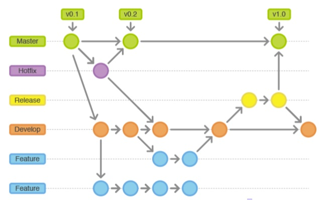

# Metodologia

Pré-requisitos: <a href="2-Especificação do Projeto.md"> Documentação de Especificação</a>

## Relação de Ambientes de Trabalho

Os artefatos do projeto são desenvolvidos a partir de diversas plataformas e a relação dos 
ambientes com seu respectivo propósito é apresentada na tabela que se segue.

|Ambiente                         |Plataforma e Link de Acesso                                                                                |
|---------------------------------|-----------------------------------------------------------------------------------------------------------|
|Repositório de código fonte      |[GitHub](https://github.com/ICEI-PUC-Minas-PMV-ADS/pmv-ads-2023-2-e4-aplicdistrib-t5-pmv-ads-2023-2-e4-g3-rentabook)          |
|Documentos do projeto            |[GitHub](https://github.com/ICEI-PUC-Minas-PMV-ADS/pmv-ads-2023-2-e4-aplicdistrib-t5-pmv-ads-2023-2-e4-g3-rentabook)          |      
|Gerenciamento de tarefas         |[GitHub](https://github.com/orgs/ICEI-PUC-Minas-PMV-ADS/projects/461/views/1)                              |
|Diagramas                        |[Lucidchart](https://lucid.app/lucidchart/4d4f1757-4a0b-451a-b8a5-e19dde46423a/edit?invitationId=inv_863d048b-9aa6-4f41-9538-69c68af99aee&page=HWEp-vi-RSFO#)|

## Controle de Versão

Para gestão do código fonte do software desenvolvido pela equipe, o grupo utiliza um processo baseado no Git Flow abordado por Vietro (2015), mostrado na Figura a seguir. Desta forma, todas as manutenções no código são realizadas em branches separados, identificados como Hotfix, Release, Develop e Feature.

## Gerenciamento de Projeto

### Divisão de Papéis

Segue a divisão de  papéis do grupo:
- Scrum Master: Vitor Alexandre Gomes Pinto;
- Product Owner: Alisson Anderson de Carvalho;
- Equipe de Desenvolvimento: Aleykson Micael Samapaio de Andrade, Alisson Anderson de Carvalho, Henrique Alexandre Gomes Pinto, Vitor Alexandre Gomes Pinto, João Lucas Pinheiro Torres e Carlos Eduardo Favilla Lobo;
- Equipe de Design: Carlos Eduardo Favilla Lobo.

### Processo

O processo consiste nas seguintes etapas: cerimônia de planejamento, dailys e retrospectiva. A cerimônia de planejamento é realizada no início da sprint para definir as tarefas a serem executadas. As dailys são realizadas diariamente para acompanhar o andamento das tarefas. A retrospectiva é realizada no final da sprint para analisar o processo e identificar oportunidades de melhoria.

### Ferramentas

As ferramentas empregadas no projeto são:

- GitHub para versionamento do projeto e organização/controle das tarefas.
- Whatsapp para comunicação entre a equipe.
