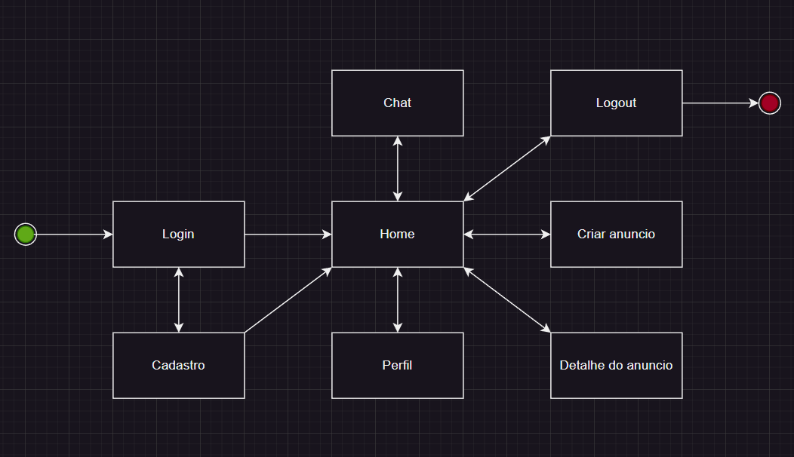

# Projeto de Interface

Pré-requisitos: <a href="2-Especificação do Projeto.md"> Documentação de Especificação</a>

Visão geral da interação do usuário pelas telas do sistema e protótipo interativo das telas com as funcionalidades que fazem parte do sistema (wireframes).

 Apresente as principais interfaces da plataforma. Discuta como ela foi elaborada de forma a atender os requisitos funcionais, não funcionais e histórias de usuário abordados nas <a href="2-Especificação do Projeto.md"> Documentação de Especificação</a>.

## Diagrama de Fluxo

O diagrama abaixo ilustra o fluxo geral da aplicação. Em algumas telas o usuário pode encontrar funcionalidade que podem ser personalizadas com filtros para exibir conteúdo específico.

# Wireframes do Projeto

Template padrão Desktop
Estrutura padrão que estará presente em quase todas as páginas do site.

Versão Mobile:

Cadastro
Página de cadastro do usuário.

Versão Mobile:

Login
Página de login do usuário.

Versão Mobile:

Anúncios
Página onde o usuário poderá escolher e buscar por anúncios.

Versão Mobile:

Modal de compra, venda e troca
Página onde o usuário poderá escolher o tipo da compra a ser feita.

Versão Mobile:

Meus Anúncios
Página onde o usuário poderá criar e editar anúncios.

Versão Mobile:

Chat
Página onde os usuários poderão conversar entre si para chegar a acordos em comum com relação a interações com os anúncios.

Versão Mobile:

Perfil
Página onde o usuário poderá editar informações sobre sua compra.

Versão Mobile:

